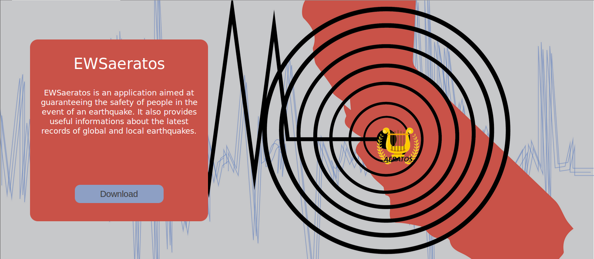
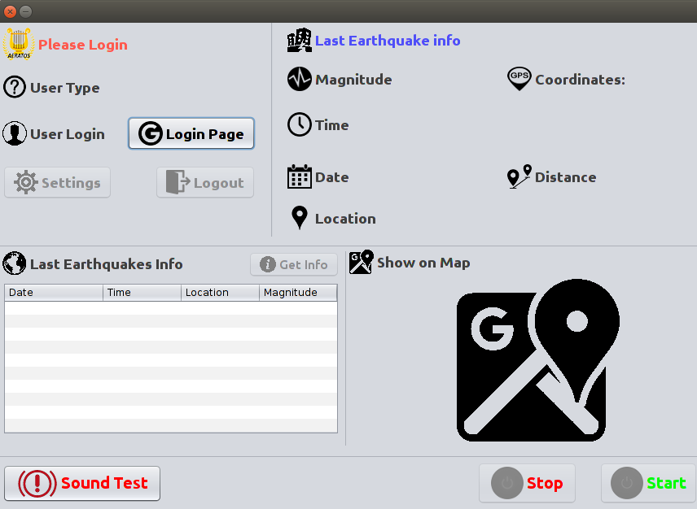
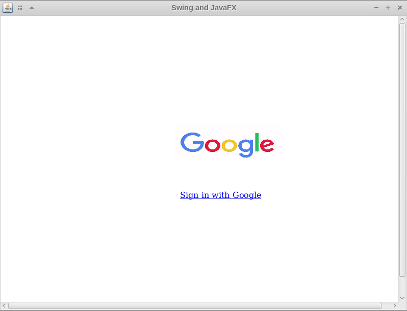
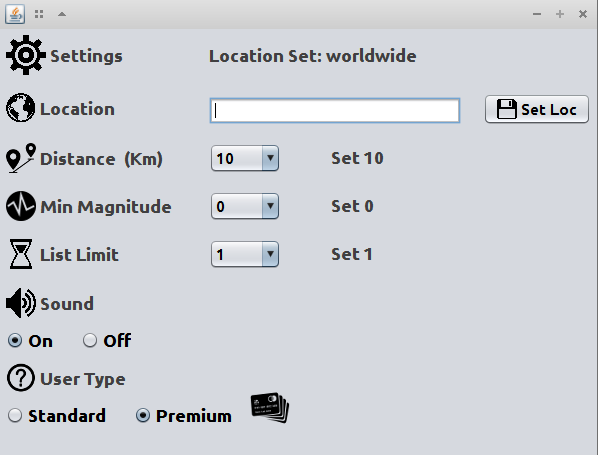
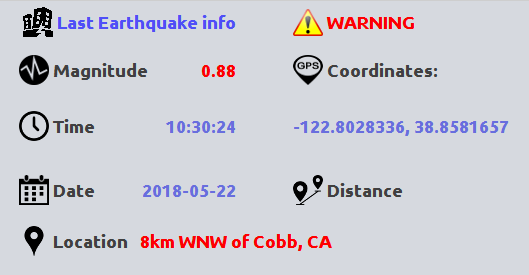
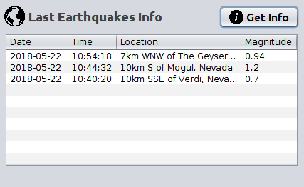

# EWSaeratos

**EWSaeratos** is a project developed to increase civil protection. **Aeratos** team believes that in a emercency situation every seconds could make the difference, for this reason we built a desktop application to launch civil warnings in case of earthquake.
Premium users can also get a list of last earthquakes, filtering them by location, distance and magnitude.

## SERVER

To open the server, type: 

```
$ bundle install  
$ rake db:migrate  
$ rails start
```
Open your browser and go to "http://localhost:3000/ and follow the instruction to download the Client




### Privacy 
Privacy is garanteed by the integration of *Google Oauth* protocol.
When Rails server starts, it use the following function to create a logger:

```Ruby
OmniAuth.config.logger = Rails.logger

#Google client id = 543824881127-hilli6393c0dvcb66en2s1695l1i9t8p.apps.googleusercontent.com
#Google client secret = DmBRdM2XryjfoGqZpa48ytCa

#Oauth middleware
Rails.application.config.middleware.use OmniAuth::Builder do
  provider :google_oauth2, '543824881127-hilli6393c0dvcb66en2s1695l1i9t8p.apps.googleusercontent.com', 'DmBRdM2XryjfoGqZpa48ytCa',      access_type: 'online', prompt: ''
end
```
The logger allows you to storage the current user in a SQLITE database with this form:

```Ruby
class User < ActiveRecord::Base
  def self.from_omniauth(auth)
    where(provider: auth.provider, uid: auth.uid).first_or_initialize.tap do |user|
      user.provider = auth.provider
      user.uid = auth.uid
      user.name = auth.info.name
      user.typeU = '0'                                                  #this is type camp: 1=stardard 2=premium User
      user.oauth_token = auth.credentials.token
      user.oauth_expires_at = Time.at(auth.credentials.expires_at)
      user.save!
    end
  end
end
```

### Earthquake Info ###
The Earthquake infos are provided by a Government agency, the United States Geological Survey (USGS), using the API https://earthquake.usgs.gov/fdsnws/event/1/

```Ruby
class QuakeController < ApplicationController

    require 'open-uri'
    require 'json'

    def get

        limitValue=params[:limit]
        password = params[:passw]

        if password == "ectrodattiliadisplasiaectodermicalabiopalatoschisi"     #complete password

            url="https://earthquake.usgs.gov/fdsnws/event/1/query?format=geojson&eventtype=earthquake&orderby=time&limit=" + limitValue.to_s    #USGS api
            prova= open(url, &:read)

            data = JSON.parse(prova)
            features = data["features"]

            retArr = Array.new(limitValue.to_i-1)

            for i in 1..limitValue.to_i
                earthquake =features[i-1]
                properties = earthquake["properties"]
                geometry = earthquake["geometry"]
                coordinates = geometry["coordinates"]

                id = earthquake["id"];
                magnetude= properties["mag"]
                place= properties["place"]
                time=properties["time"].to_i

                timeEpo = Time.at(time /1000).to_s

                formattedTime=timeEpo.split(" ")[0] +" "+ timeEpo.split(" ")[1] ;

                ret ={"id"=> id.to_s, "magn" => magnetude.to_s, "place" => place.to_s, "time" => formattedTime.to_s, "coord" => coordinates }
                retArr[i-1]=ret
            end

            render json: {"elem" => retArr}

        else
            render json: {"status" => "error"}
        end
    end

end
```
### Security ###
The communication are secured by using a two-step password. The first half of the password is sent to client by the server after the loggin, while the second part is stored in the client. By merging the two part, the client obtains the final password, it will be used to guarantee the access to earthquakes informations.
With this approach we can guarantee that a user must use the client application and must be logged to gain earthquake informations.

Rails function used to send password to client:

```Ruby
class StatusController < ApplicationController
    def index
	passw="ectrodattiliadisplasiaectodermica"                           #First part of password
        if current_user                                                 #If User is logged I can send to Client the first part of password
            userType=params[:type]
            current_user.typeU = userType
            current_user.save!
            ret ={"status" => "logged", "type" => userType.to_s, "pass" => passw.to_s}
            render json: ret
        else
            ret ={"status" => "unlogged"}
            render json: ret
        end
    end
end
```

## CLIENT ##
The first startup requires user login.



### Login ###
To login the user must click on "Login Button". The Google login page is reached by an internal browser, thus even user without browser or with a poor connection can easily access to our service.



Once the user had login successfully with his Google Account, the same browser will be redirect to our welcome html page. When the user close the browser will be prompted to be a Standard or Premium User.

The following code is used to create the internal browser window:
```Java
private static Scene createScene() {
        Scene scene = new Scene(new Group());


        final WebView browser = new WebView();
        final WebEngine webEngine = browser.getEngine();

        ScrollPane scrollPane = new ScrollPane();
        scrollPane.setContent(browser);

        webEngine.getLoadWorker().stateProperty()
            .addListener(new ChangeListener<Worker.State>() {
              @Override
              public void changed(ObservableValue ov, Worker.State oldState, Worker.State newState) {

                if (newState == Worker.State.SUCCEEDED) {
                  //stage.setTitle(webEngine.getLocation());
                }

              }
            });
        
        //webEngine.load("http://www.google.com");
        webEngine.load(url);

        scene.setRoot(scrollPane);
        return(scene);
    }
```

### Settings ###
User can set his preferences in Settings window:
- Location: user can enter the name of his city (or the nearest large city), could be also worldwide if he wants know earthquakes info around the world.
- Distance: user can decide distance ray (kilometrers) from the epicenter.
- Magnitude: user can decide to filter the earthquakes that are equals or greater than choosen magnitude.
- Limit: this is a features reserved to Premium user, it allows to select the max number of earthquakes that will be display on "Get Info" table.
- Sound: user can turn on/off audio warning.
- User Type: allows to switch to Standard or Premium User.




### Last Earthquake Info ###
In this Panel is show the last earthquake infos that match user restrictions.




### Start ###
By clicking Start a Thread will be initialized. It will fetch infos from server every second, filtering them and calculate if match user preferences.
To Stop and kill the Thread user can press Stop button. It will flag a boolean system variable, then the Thread will check every seconds the value, if it's true will stop polling function.
Thread Start:
```Java
public void run() {
        int limitInt= Integer.parseInt(limit);
        if(limitInt==1){
            startGUI();
            while(true){
                try {
                    polling();
                    Thread.sleep(1000);    //sleep Thread 1 sec
                    if(settings.getBoolValue("stopServer")){
                        stopGUI();
                        return;
                    }
                } catch (InterruptedException ex) {
                    Logger.getLogger(EarthQuakeCheck.class.getName()).log(Level.SEVERE, null, ex);
                    stopGUI();
                }
            }
        }
        else{
            getInfoList= new LinkedList<String>();
            getInfo();
        }
    }
```

**Polling** function get the info by server, parse them, and check if them match user preferences. It will also filter the earthquake id, to avoid different warnings on the same earthquake.
```Java
private void polling(){
	BufferedReader br=null;
	try {
		URL url=new URL(defaultURL+limit+"&passw="+clientPass);
		HttpURLConnection huc = (HttpURLConnection) url.openConnection();
		br = new BufferedReader(new InputStreamReader(huc.getInputStream()));
		String ret= br.readLine();
		JSONObject j=new JSONObject(ret);
		JSONArray data=j.getJSONArray("elem");
		for (int i=0;i<data.length();i++) {
			JSONObject dataElem=data.optJSONObject(i);
			String id=dataElem.getString("id");
			String place=dataElem.getString("place");
			String time=dataElem.getString("time");
			String magn=dataElem.getString("magn");
			String coord0=dataElem.getString("coord").split(",")[0].substring(1);
			String coord1=dataElem.getString("coord").split(",")[1];

			//System.out.println("id: "+id+" Place: "+place+" time: "+time+" Magn: "+magn +" coord0: "+coord0 +" coord1: "+coord1);                
			if(locationFilter(coord0, coord1) && magnitudeFilter(magn) && lastQuakeCheck(id)){
				refreshLastEq(place, time, magn, coord0, coord1);
				warning.start();
				settings.SaveSetting("string", "lastEqCoo0", coord0);
				settings.SaveSetting("string", "lastEqCoo1", coord1);
			}
		}
		br.close();
	} catch (IOException ex) {
		Logger.getLogger(EarthQuakeCheck.class.getName()).log(Level.SEVERE, null, ex);
		btnStart.setEnabled(true);
		btnStop.setEnabled(false);
	} catch (JSONException ex) {
		Logger.getLogger(EarthQuakeCheck.class.getName()).log(Level.SEVERE, null, ex);
	}
}
```

### Map ###
This feature will show map location using the internal browser. It will be available in case of earthquake.


### Get Info ###
This features is reserved to Premium user. It allows to get info of last earthquakes that matches user settings.


